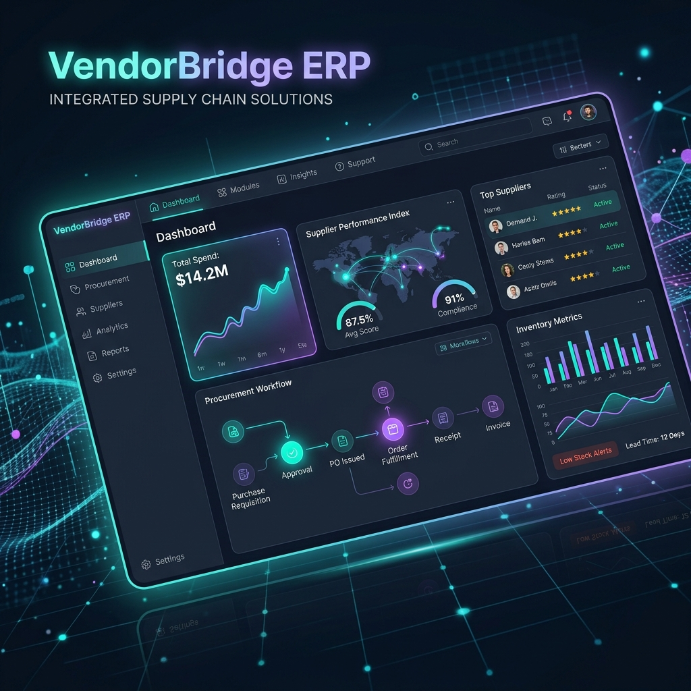
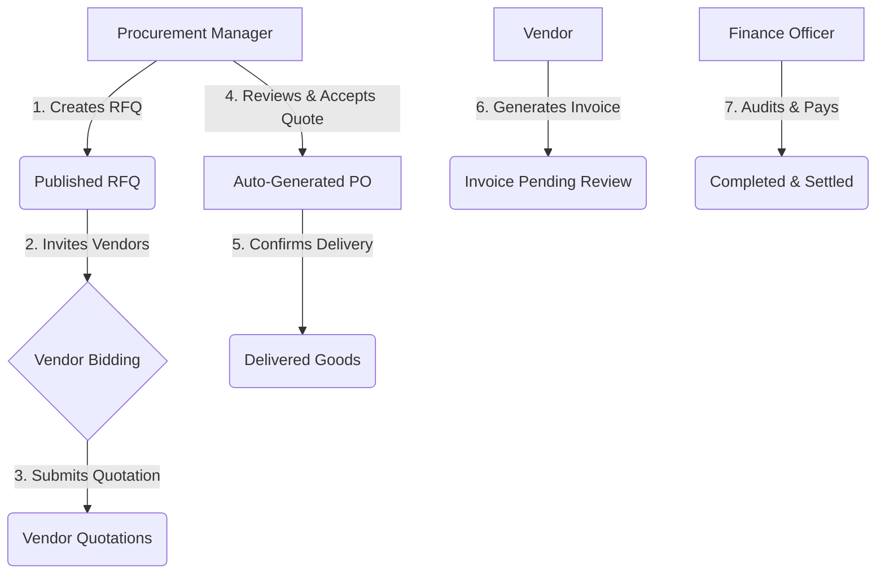

# VendorBridge ERP - Procurement & Vendor Lifecycle Management



<div align="center">

[](https://nextjs.org/)
[](https://supabase.com/)
[](https://tailwindcss.com/)
[](https://ui.shadcn.com/)
[](https://www.typescriptlang.org/)
[](https://vercel.com/)
[](https://opensource.org/licenses/MIT)

**A complete, production-grade, secure, and modern Procurement & Vendor lifecycle ERP built to streamline corporate buying from RFQ to Invoice.**

[Live Application Demo](https://vendorbridge.vercel.app) • [Setup Quick Start](#-quick-start) • [Database Architecture](#-security--database-schema) • [Video Walkthrough](https://youtube.com)

</div>

---

## 💡 Hackathon Focus: Problem & Solution

### The Challenge
For mid-market enterprises and growing startups, procurement is a massive headache. Standard ERPs (such as SAP or Oracle) are incredibly expensive, complex to configure, and present confusing user interfaces. On the other hand, small-to-medium businesses (SMBs) struggle with scattered emails, Excel sheets, and manual PDFs to coordinate RFQs, gather vendor quotations, and match invoices. This leads to:
* **Procurement leakage** (buying from unapproved vendors).
* **Communication gaps** (lost email quotations or incorrect specs).
* **Security vulnerabilities** (exposing sensitive bidding pricing between competing suppliers).
* **Lack of audit trails** for compliance and finance tracking.

### The Solution: VendorBridge ERP
VendorBridge bridges the gap between procurement teams and suppliers. Built in under 72 hours for the hackathon, it provides a centralized, secure portal featuring:
1. **Streamlined Workflow**: Direct conversion path from Request for Quotation (RFQ) ➔ Vendor Bidding ➔ Purchase Order (PO) ➔ Invoice.
2. **Granular Role-Based Access Control (RBAC)**: Custom panels for Administrators, Procurement Managers, Suppliers, and Finance Officers.
3. **Database-Enforced Security**: Zero-leakage environment where competing vendors can never view each other's data or bid prices, enforced using PostgreSQL Row-Level Security (RLS) policies.
4. **Vibrant & Themeable UX**: Responsive layout designed to be simple for buyers and vendors alike, with persistable dark and light modes.

---

## 🔄 The Procurement Lifecycle

VendorBridge automates the entire procurement cycle, transforming unstructured communications into a structured transaction pipeline:



1. **RFQ Generation**: The Procurement Manager lists items, quantities, budgets, and deadlines.
2. **Supplier Bid Submissions**: Invited suppliers access a restricted dashboard to submit prices, terms, and delivery dates.
3. **Quotation Acceptance**: Managers review all bids side-by-side. Accepting a quotation automatically closes the RFQ and generates a formal Purchase Order (PO).
4. **Invoice Verification**: The Vendor issues an invoice against the PO. The Finance Officer conducts a three-way match (RFQ ➔ PO ➔ Invoice) and schedules payment.

---

## 🔑 Role-Based Access Control (RBAC)

A key highlight of VendorBridge is its strict permission layout. The dashboard adapts dynamically depending on the logged-in user's role:

| Feature Module | 👑 Admin | 💼 Procurement | 🤝 Vendor | 💳 Finance | Enforced By |
| :--- | :---: | :---: | :---: | :---: | :--- |
| **Manage Vendors** | Write | Read | — | — | Database RLS |
| **Create RFQs** | — | Write | — | — | Database RLS |
| **Submit Quotations** | — | — | Write | — | Database RLS |
| **Approve Quotations** | — | Write | — | — | Database RLS |
| **Manage POs** | Read | Write | Read (Own) | Read | Database RLS |
| **Process Invoices** | Read | — | Write (Own) | Write | Database RLS |
| **Audit Logs** | Write | — | — | — | Database RLS |

---

## 🛠️ Technology Stack

VendorBridge is built on a modern, robust stack configured for low latency, server-side performance, and absolute type safety.

* **Frontend**:
  * **Next.js 16 (App Router)**: Hybrid routing with Server Components and Client Components for maximum performance.
  * **Tailwind CSS v4.0**: Styling engine utilizing modern HSL variables for custom UI styling.
  * **shadcn/ui**: Accessible and fully themeable components.
  * **React Hook Form & Zod**: Schema-based form validation ensuring zero bad payloads reach the server.
* **Backend & Database**:
  * **Supabase PostgreSQL**: Managed relation database with tables connected via foreign key constraints.
  * **Supabase Authentication**: Session handling via secure cookies.
  * **PostgreSQL Row-Level Security (RLS)**: Policies checking roles (`user_role`) to isolate database rows.
* **Infrastructure**:
  * **Vercel Edge Network**: Instant deployment and serverless server actions.
  * **Next.js Server Actions**: Form submissions and database changes triggered without custom REST APIs.

---

## 🔒 Security & Database Schema

VendorBridge secures commercial-in-confidence data at the engine tier. A compromised frontend route will still fail to load data because the Supabase client passes the authenticated user's JWT directly to PostgreSQL, which filters query results using Row-Level Security (RLS).

### Schema Layout
The database schema consists of 10 primary tables managed by SQL migrations under [`supabase/migrations`](file:///d:/Vendorbridge/supabase/migrations):

```
├── profiles (Extended user details, auth-synced via DB triggers)
├── vendors (Supplier profiles, categories, ratings)
├── rfqs (Request for quotations)
├── rfq_items (Line-items for RFQs)
├── quotations (Bids submitted by suppliers)
├── quotation_items (Line-item prices for quotations)
├── purchase_orders (Agreed purchase contracts)
├── po_items (Line-items for purchase orders)
├── invoices (Billing requests)
└── audit_logs (System modifications log for compliance)
```

### Critical RLS Implementation Example
For example, to prevent vendors from viewing each other's competitive bids, the following policy is applied to the `quotations` table:
```sql
CREATE POLICY "Vendors can only view/manage their own quotations"
ON public.quotations
FOR ALL
USING (auth.uid() = vendor_id OR EXISTS (
  SELECT 1 FROM public.profiles 
  WHERE profiles.id = auth.uid() AND profiles.role IN ('admin', 'procurement_manager', 'finance')
));
```

---

## 📁 Repository Blueprint

```
vendorbridge-erp/
├── app/
│   ├── actions/                 # Next.js Server Actions (Database CRUD)
│   │   ├── activity.ts          # Audit logging
│   │   ├── approvals.ts         # Manager approval flows
│   │   ├── invoices.ts          # Invoicing management
│   │   ├── purchase-orders.ts   # PO status updates
│   │   ├── quotations.ts        # Bids creation & selection
│   │   └── rfqs.ts              # RFQ creation & publishing
│   ├── auth/                    # Next.js Auth flow and callbacks
│   ├── dashboard/               # Main ERP views (Role-guarded)
│   │   ├── activity/            # System audit logs
│   │   ├── approvals/           # Manager queue
│   │   ├── invoices/            # Finance ledger
│   │   ├── purchase-orders/     # Operations center
│   │   ├── quotations/          # Vendor bidding center
│   │   ├── reports/             # Spend & KPI reports
│   │   └── rfqs/                # RFQ catalog
│   ├── globals.css              # Custom Tailwind CSS v4 styling
│   └── page.tsx                 # Auto-routing landing page
├── components/                  # Custom components
│   ├── ui/                      # Base shadcn component library
│   ├── RFQModal.tsx             # Interactive RFQ creator
│   ├── QuotationSubmissionModal.tsx # Supplier bid form
│   └── VendorModal.tsx          # Vendor registry component
├── lib/
│   ├── supabase/                # Supabase Clients (Server, Browser, Admin)
│   │   ├── admin.ts             # Service-role admin client (for vendor invites)
│   │   └── proxy.ts             # Next.js Middleware route guards
│   ├── theme-provider.tsx       # LocalStorage theme controller
│   └── types.ts                 # TS Interface declarations
├── supabase/                    # Migration configurations
│   ├── migrations/              # SQL structural updates
│   └── README.md                # DB migration guidelines
└── package.json                 # Project configuration files
```

---

## ⚡ Quick Start

Follow these steps to run VendorBridge ERP locally.

### Prerequisites
* **Node.js**: `18.x` or above.
* **pnpm** (or npm/yarn): For package management.
* **Supabase Project**: Active database instance.

### 1. Clone & Install Dependencies
```bash
git clone https://github.com/yourusername/vendorbridge-erp.git
cd vendorbridge-erp
pnpm install
```

### 2. Set Up Environment Variables
Create a `.env` file in the root directory and add your Supabase credentials:
```env
NEXT_PUBLIC_SUPABASE_URL=https://your-project-ref.supabase.co
NEXT_PUBLIC_SUPABASE_ANON_KEY=your-anon-public-key
SUPABASE_SERVICE_ROLE_KEY=your-secure-service-role-key # For supplier invites
```

### 3. Deploy Database Schema
Push the local database migration scripts to your linked Supabase account:
```bash
# Link to your Supabase project (first time setup)
npx supabase link --project-ref YOUR_PROJECT_REF

# Push migrations
npm run db:push
```
*Alternatively, you can copy the raw SQL files from [`supabase/migrations`](file:///d:/Vendorbridge/supabase/migrations) directly into the Supabase SQL Editor and run them.*

### 4. Boot Up Development Server
```bash
pnpm dev
```
Open [http://localhost:3000](http://localhost:3000) in your web browser.

---

## 🧠 Hackathon Learnings & Hurdles

### 1. Multi-Role UI Routing
**Challenge**: Ensuring a clean dashboard transition when logging in as different roles (e.g., logging in as a Vendor versus a Procurement Manager).
**Solution**: Implemented a Next.js `middleware.ts` combined with an helper function [`updateSession`](file:///d:/Vendorbridge/lib/supabase/proxy.ts). It intercepts incoming cookies, matches the user against the database `profiles` table, and guards dashboard folders.

### 2. Live Reactivity without REST
**Challenge**: Keeping dashboard counters and KPI cards up to date without continuously poll-querying the database.
**Solution**: Utilized Next.js Server Actions with immediate cache revalidation (`revalidatePath`). When a vendor submits a quote, the UI refreshes state server-side instantly.

### 3. Securing Competing Bids
**Challenge**: Setting up PostgreSQL security rules so suppliers could submit quotations for an RFQ, but never query other vendors' bid pricing.
**Solution**: Authored a custom multi-policy configuration inside `supabase/migrations/20260606000400_vendor_quotation_submission_permissions.sql` which enforces that read permission queries check the caller's ID or organization association.

---

## 🔮 Future Roadmap

* [ ] **AI-Powered Supplier Scoring**: Analyze vendor delivery times and historical pricing to suggest the optimal quotation automatically.
* [ ] **Automated Document Parsing**: OCR integration to parse supplier PDFs directly into purchase orders and invoice forms.
* [ ] **Real-Time WebSockets Notifications**: Instant push alerts when an RFQ receives a new bid or an invoice is settled.
* [ ] **Multi-Currency Transactions**: Global currency support with automatic conversion rates.

---

## 📄 License

This project is licensed under the MIT License - see the [LICENSE](LICENSE) file for details.

---

**Built with ❤️ by Hackathon Team VendorBridge**
